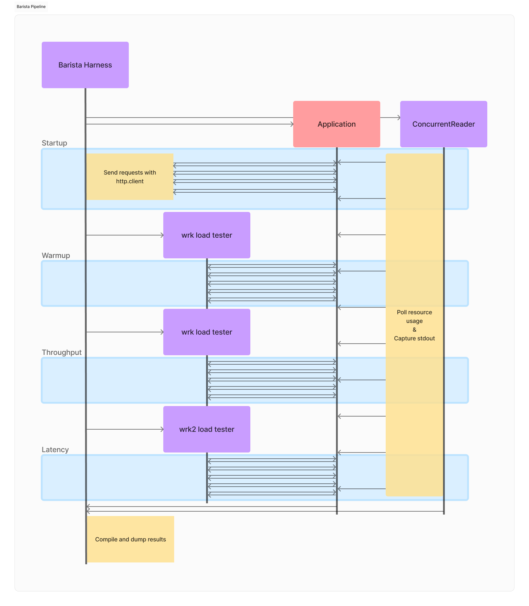

# Barista Suite

Welcome!

Barista Suite is an open-source benchmark suite dedicated to measuring the performance of Java microservices.


Just like a good barista knows what the client needs, this benchmark suite provides key metrics for evaluating microservices. 
When measuring the performance there are many more metrics than peak throughput, for microservices. 
Some microservices may have higher throughput, while some may use less resources and have better latency. 
Having large selection of metrics can be helpful in understanding differences between microservice builds and frameworks. Currently supported metrics are:

- Throughput
- Latency
- Startup time
- First response times
- Warmup throughput
- Memory usage(RSS and VMS)
- CPU usage

## Outline

- [Quick start](#quick-start)
- [Dependencies](#dependencies)
- [Execution modes](#execution-modes)
- [Barista applications](#barista-applications)
- [Building the Barista apps](#building-the-barista-apps)
- [Benchmarking](#benchmarking)
- [Supported harness options](#supported-harness-options)
- [Pipeline](#pipeline)
- [Examples](#example-configurations)
- [Contributing](#contributing)

## Dependencies

### Python dependencies (only for non-Linux platforms)

Barista runs with no python dependency on Linux operating systems. For MacOS and Windows, the harness relies on [psutil](https://pypi.org/project/psutil/). Here are the setup instructions:

First of all create or change to your preferred virtual environment.
To create a virtual environment run:
```console
python -m venv venv
```

Then switch to the created environment run the command in the same folder:
```console
source venv/bin/activate
```

Efforts have been made to minimize the number of dependencies to ease usage. However, `psutil` is still required for non-Linux platforms. Barista uses this package for process termination and the collection of process resource usage information.

If you're running Barista on any platform other than Linux, please install `psutil` by running:
```console
pip install psutil
```

### wrk and wrk2

[wrk](https://github.com/wg/wrk) tool is used for throughput measurements and warming up microservices with JIT compilers. 
For detailed latency measures we use [wrk2](https://github.com/giltene/wrk2).

You can get the tools source code and build it yourself from here:
- [wrk](https://github.com/wg/wrk)
- [wrk2](https://github.com/giltene/wrk2)

Or from default linux packages.

Once you have tested (and built) the tools add them to your `PATH` environment variable:

```bash
export PATH="$PATH:/your/path/to/wrk"
export PATH="$PATH:/your/path/to/wrk2"
```

Also make sure to rename the executable in wrk2 folder from `wrk` to `wrk2` this is necessary for benchmark to differentiate the two.

You can simply do that by going to the `wrk2` directory and executing:
```console
mv wrk wrk2
```

## Quick Start

You can inform yourself on the details of the benchmark suite in the upcoming sections, this section will just give you instructions for default use-cases.

It is necessary to first build the Barista applications that we wish to benchmark.
```console
./build
```
This command will build all the Barista apps, if you want to speed up the process you can build just a specific one. Take a look at the [Building the Barista apps](#building-the-barista-apps) section for information.

To quickly test the suite, you can execute the following command:
```console
./barista micronaut-hello-world
```
Which benchmarks the `micronaut-hello-world` app with default configurations.

To run the same benchmark in native mode, run the following:
```console
./barista micronaut-hello-world --mode native
```

## Barista applications

The Barista benchmark suite comprises a broad and varied selection of applications, covering an array of widely-used microservice frameworks.

This is the list of Barista applications:
- ### vanilla-hello-world
    Minimal microservice implemented using the standard library package [com.sun.net.httpserver](https://docs.oracle.com/en/java/javase/17/docs/api/jdk.httpserver/com/sun/net/httpserver/package-summary.html)
- ### micronaut-hello-world
    Minimal microservice implemented in the [Micronaut](https://micronaut.io/) framework
- ### micronaut-shopcart
    A fairly complex demo application modelling a web shop implemented in the [Micronaut](https://micronaut.io/) framework
- ### micronaut-similarity
    A text similarity application implemented in the [Micronaut](https://micronaut.io/) framework
- ### quarkus-hello-world
    Minimal microservice implemented in the [Quarkus](https://quarkus.io/) framework
- ### quarkus-tika
    A PDF/ODT document processing application implemented in the [Quarkus](https://quarkus.io/) framework
- ### spring-hello-world
    Minimal microservice implemented in the [Spring](https://spring.io/) framework
- ### spring-petclinic
    A fairly complex demo application modelling a pet clinic implemented in the [Spring](https://spring.io/) framework
- ### helidon-hello-world
    Minimal microservice implemented in the [Helidon](https://helidon.io/) framework
- ### vertx-hello-world
    Minimal microservice implemented in the [Vert.x](https://vertx.io/docs/) framework
- ### ktor-hello-world
    Minimal microservice written in Kotlin in the [Ktor](https://ktor.io/) framework
- ### play-scala-hello-world
    Minimal microservice written in Scala in the [Play](https://www.playframework.com/) framework

You can find the implementations in the `benchmarks` subdirectory.

## Execution modes

Barista supports benchmarking in two modes: JVM and native.
- In the JVM mode the application is executed on a Java Virtual Machine.
- In the native mode the application is natively executed. This mode is compatible with any natively executable file, but is primarily focused on executing GraalVM native images, including the integrated workflow for generating Native Image Bundles (nibs) and then building application images using the bundles. You can learn more about native images [here](https://www.graalvm.org/latest/reference-manual/native-image/).

## Building the Barista apps

There is a top-level Barista build script which you can use to build a selection (or all) of the apps. This script builds the application jar and nib (Native Image Bundle) files. The application jar is used for benchmarking in the JVM mode, while the nib is used for benchmarking in the native mode.
Specify the name(s) of the applications you wish to build, adding the `--skip-nib-generation` option if you don't need to generate nibs. If you don't specify a single application, all of them will be built.

Build all applications, generating both jars and nibs:
```console
./build
```

Example command for building a selection of applications, requesting only the generation of jars, skipping the generation of nibs:
```console
./build micronaut-hello-world quarkus-tika --skip-nib-generation
```

The interface of the Barista build script:
```
usage: build [-h] [-s] [-m MAVEN_OPTIONS] [-d] [bench-name ...]

positional arguments:
  bench-name            name(s) of the benchmark(s) to be built, all are built if unspecified

options:
  -h, --help            show this help message and exit
  -s, --skip-nib-generation
                        skip building nibs (Native Image Bundles), only build the jars
  -m MAVEN_OPTIONS, --maven-options MAVEN_OPTIONS
                        additional options to pass to mvn when building maven projects
  -d, --debug           show debug logs
```

Additionally, each Barista application contains a `build.sh` script at its directory level. The top-level Barista build script invokes these app-level build scripts for its selection.
```
Builds the project jar and then uses GraalVM to generate a nib file (Native Image Bundle)

usage: build.sh [--help] [--skip-nib-generation] [--get-jar] [--get-nib]

options:
    --help                  shows this help message and exits
    --skip-nib-generation   skips building the application nib (Native Image Bundle) file, only builds the jar
    --get-jar               prints the path of the built jar without building anything. The path will be printed in the pattern of 'application jar file path is: <path>\n'
    --get-nib               prints the path of the built nib (Native Image Bundle) file without building anything. The path will be printed in the pattern of 'application nib file path is: <path>\n'
```

## Benchmarking

Here is an example where several of the options are provided:
```console
./barista micronaut-hello-world --mode native --warmup-duration=1 --throughput-duration=1 --latency-duration=1 --cmd-app-prefix="time -v" --vm-options="-XX:+PrintGC" --native-image-build-options="-O0"
```
This command benchmarks the `micronaut-hello-world` app in the `native` execution mode, with a 1s warmup, 1s throughput measurement, 1s latency measurement, and values from the default configuration file (`workloads/default.barista.json`) for the rest of the harness options. It prefixes the app command with `time -v`, propagating `-XX:+PrintGC` to the virtual machine, and propagating `-O0` to the native image build process.

Explore the supported harness options in the following section.

## Supported harness options

All of the configuration options in the command line are optional and will overwrite any configuration options coming from the configuration file. 
If no configuration file is provided with `--config path/to/your/config.json` flag the default config is taken from `<bench-dir>/workloads/default.barista.json`.

For more detailed configuration options, you can run:
```console
./barista --help
```
 to print out all of the available options.

```console
usage: barista [-h] [-j JAVA_HOME] [-m {jvm,native}] [-c CONFIG] [-x APP_EXECUTABLE] [-e ENDPOINT] [-o OUTPUT] [-t THREADS] [-k CONNECTIONS] [-s LUA_SCRIPT] [--resource-usage-polling-interval RESOURCE_USAGE_POLLING_INTERVAL] [--skip-prepare] [--skip-cleanup] [-d] [-p CMD_APP_PREFIX] [-v VM_OPTIONS] [-a APP_ARGS] [-b NATIVE_IMAGE_BUILD_OPTIONS] [--startup-iteration-count STARTUP_ITERATION_COUNT]
               [--startup-timeout STARTUP_TIMEOUT] [--warmup-iteration-count WARMUP_ITERATION_COUNT] [--warmup-duration WARMUP_DURATION] [--warmup-threads WARMUP_THREADS] [--warmup-connections WARMUP_CONNECTIONS] [--warmup-lua-script WARMUP_LUA_SCRIPT] [--throughput-iteration-count THROUGHPUT_ITERATION_COUNT] [--throughput-duration THROUGHPUT_DURATION] [--throughput-threads THROUGHPUT_THREADS]
               [--throughput-connections THROUGHPUT_CONNECTIONS] [--throughput-lua-script THROUGHPUT_LUA_SCRIPT] [--latency-iteration-count LATENCY_ITERATION_COUNT] [--latency-duration LATENCY_DURATION] [--latency-threads LATENCY_THREADS] [--latency-connections LATENCY_CONNECTIONS] [--latency-search-strategy LATENCY_SEARCH_STRATEGY] [--latency-rate LATENCY_RATE] [--latency-percentages LATENCY_PERCENTAGES]
               [--latency-min-step-percent LATENCY_MIN_STEP_PERCENT] [--latency-sla LATENCY_SLA] [--latency-lua-script LATENCY_LUA_SCRIPT]
               {helidon-hello-world,ktor-hello-world,micronaut-hello-world,micronaut-shopcart,micronaut-similarity,play-scala-hello-world,quarkus-hello-world,quarkus-tika,spring-hello-world,spring-petclinic,vanilla-hello-world,vertx-hello-world}

positional arguments:
  {helidon-hello-world,ktor-hello-world,micronaut-hello-world,micronaut-shopcart,micronaut-similarity,play-scala-hello-world,quarkus-hello-world,quarkus-tika,spring-hello-world,spring-petclinic,vanilla-hello-world,vertx-hello-world}
                        Name of the benchmark

options:
  -h, --help            show this help message and exit
  -j JAVA_HOME, --java-home JAVA_HOME
                        Path to the JVM distribution to be used. If not provided, the JAVA_HOME environment variable is used
  -m {jvm,native}, --mode {jvm,native}
                        Execution mode of the app
  -c CONFIG, --config CONFIG
                        Path to the configuration JSON file to be used for load testing, can be either absolute or relative to the <bench-dir>/workloads directory. Defaults to 'default.barista.json'
  -x APP_EXECUTABLE, --app-executable APP_EXECUTABLE
                        Path to the application executable. If this is not set, the application executable is retrieved (built, in the case of native execution) from the benchmark directory
  -e ENDPOINT, --endpoint ENDPOINT
                        Endpoint of the application which will be loaded
  -o OUTPUT, --output OUTPUT
                        Path to the directory in which a timestamped directory will be created. Barista stores all its output in this timestamped directory. Defaults to the current working directory.
  -t THREADS, --threads THREADS
                        Number of threads to use during the warmup, throughput and latency load-testing phases. This option can be overwritten for each of the mentioned phases. During each phase, the number of threads is propagated to wrk/wrk2. The number of threads is also propagated to the Lua script that the wrk/wrk2 tool executes, enabling the writing of scripts that are aware of the number of threads executing them.
  -k CONNECTIONS, --connections CONNECTIONS
                        Connections to keep open during the warmup, throughput and latency load-testing phases. This option can be overwritten for each of the mentioned phases. During each phase, the number of connections is propagated to wrk/wrk2.
  -s LUA_SCRIPT, --lua-script LUA_SCRIPT
                        Lua script to be executed by wrk/wrk2 for general benchmarking purposes
  --resource-usage-polling-interval RESOURCE_USAGE_POLLING_INTERVAL
                        Time interval in seconds between two subsequent resource usage polls. Determines how often resource usage metrics, such as rss (Resident Set Size), vms (Virtual Memory Size), and CPU utilization, are collected. If set to 0 resource usage polling is disabled. Defaults to 0.02s (20ms)
  --skip-prepare        Explicitly skip the prepare step of the benchmark, even if a prepare script is present in the benchmark directory
  --skip-cleanup        Explicitly skip the cleanup step of the benchmark, even if a cleanup script is present in the benchmark directory
  -d, --debug           Show debug logs
  -p CMD_APP_PREFIX, --cmd-app-prefix CMD_APP_PREFIX
                        Command to be prefixed to the application startup command
  -v VM_OPTIONS, --vm-options VM_OPTIONS
                        Options to be propagated to the virtual machine (JVM in jvm execution mode, native-image in native execution mode)
  -a APP_ARGS, --app-args APP_ARGS
                        Arguments to be propagated to the application
  -b NATIVE_IMAGE_BUILD_OPTIONS, --native-image-build-options NATIVE_IMAGE_BUILD_OPTIONS
                        Options to be propagated to the native-image build command (used only in native execution mode when no '--app-executable' option is provided)
  --startup-iteration-count STARTUP_ITERATION_COUNT
                        Number of requests to make and record the response time of, immediately after starting the application
  --startup-timeout STARTUP_TIMEOUT
                        Period of time without receiving a response from the app after which it is deemed unresponsive and the benchmark is stopped. If set to 0 the app will never be deemed unresponsive. Defaults to 60
  --warmup-iteration-count WARMUP_ITERATION_COUNT
                        Number of iterations that should be performed before testing the application
  --warmup-duration WARMUP_DURATION
                        Single iteration warmup time duration in seconds. How long should the application be stressed before testing
  --warmup-threads WARMUP_THREADS
                        Number of threads to use for warmup, overrides the '--threads' option specifically for warmup iterations
  --warmup-connections WARMUP_CONNECTIONS
                        Connections to keep open during warmup, overrides the '--connections' option specifically for warmup iterations
  --warmup-lua-script WARMUP_LUA_SCRIPT
                        Lua script to be executed by wrk during warmup, overrides the '--lua-script' option specifically for warmup iterations
  --throughput-iteration-count THROUGHPUT_ITERATION_COUNT
                        Number of iterations that will be performed to measure throughput
  --throughput-duration THROUGHPUT_DURATION
                        Duration in seconds of a single iteration of throughput measurement
  --throughput-threads THROUGHPUT_THREADS
                        Number of threads to use for throughput measurements, overrides the '--threads' option specifically for throughput iterations
  --throughput-connections THROUGHPUT_CONNECTIONS
                        Connections to keep open during throughput measurements, overrides the '--connections' option specifically for throughput iterations
  --throughput-lua-script THROUGHPUT_LUA_SCRIPT
                        Lua script to be executed by wrk during throughput measurements, overrides the '--lua-script' option specifically for throughput iterations
  --latency-iteration-count LATENCY_ITERATION_COUNT
                        Number of iterations that will be performed to measure latency
  --latency-duration LATENCY_DURATION
                        Time in seconds of how long should single iteration of latency measurment take
  --latency-threads LATENCY_THREADS
                        Number of threads to use for latency measurements, overrides the '--threads' option specifically for latency iterations
  --latency-connections LATENCY_CONNECTIONS
                        Connections to keep open during latency measurements, overrides the '--connections' option specifically for latency iterations
  --latency-search-strategy LATENCY_SEARCH_STRATEGY
                        Strategy to be used when searching for the optimal throughput
  --latency-rate LATENCY_RATE
                        Constant throughput (in ops/sec) applied to measure latency
  --latency-percentages LATENCY_PERCENTAGES
                        Fraction of throughput recorded in throughput measurements to be used in latency measurements
  --latency-min-step-percent LATENCY_MIN_STEP_PERCENT
                        Accuracy with which to perform the latency search
  --latency-sla LATENCY_SLA
                        Latency Service Level Agreement entry
  --latency-lua-script LATENCY_LUA_SCRIPT
                        Lua script to be executed by wrk2 during latency measurements, overrides the '--lua-script' option specifically for latency iterations
```
### Lua scripts

The wrk and wrk2 load testers support scripts for generating custom loads. Lua is supported the programming language for scripting functionality in wrk and wrk2.
Lua scripts are split across multiple layers. The top level Lua script resides under the `"load_testing"` key in the json file named `"lua_script"` or `--lua-script` 
flag. 
This option propagates the given lua script to the all the measurement steps that are:

- Warmup
- Throughput
- Latency

However, to overwrite the script in one of these fields you can add `"lua_script":"path/to/your/lua/script.lua"` key and value pair in the JSON under the specific 
load testing step. 
Or you can add a command line flag:

- Warmup: `--warmup-lua-script`
- Throughput: `--throughput-lua-script`
- Latency: `--latency-lua-script`


## Pipeline

A quick overview of the whole flow can be seen here:



The main phases are as follows. *NOTE*: they can all be skipped by providing `0` as the number of iterations for the configuration.

### Startup Phase

The startup phase occurs immediately after the application's cold start. During this phase the harness records the response time to `--startup-iteration-count` requests sent to the application.

### Warmup Phase

The warmup phase is dedicated for JVM applications with JIT compiler to ensure that they reach the peak throughput before actual measurements begin.
Currently there is no automation when does the warmup period "end"(Warmup is tricky and may never end), so it is up to a user to define a good number of iterations 
and time duration for their application so they would ensure it has warmed up.

### Throughput Phase

First time measurement phase after warmup. Records requests per second with `wrk` to return the average seen throughput for each of the iterations defined.

### Latency Phase

The suite uses `wrk2` to measure latency under constant load in a distinct step than the throughput measurement. The reason is that it is not desirable to report latency while measuring throughput because latency won't be comparable across experiments since a different throughput will directly impact latency (more throughput means more memory pressure, hence higher tail latency).

`wrk2` reports the full latency distribution and this is captured in separate file for further analysis if need be. However, the harness extracts the major percentiles (p50, p75, p99, p99.99, p99.999, p100) for convenience and stores them in a CSV. 

#### Fixed rates and percentages

The latencies can be measured in fixed rates and percentages. 
Fixed rate is required to be provided in order for `wrk2` tool for preventing [Coordinated Omission](https://www.artillery.io/blog/load-testing-workload-models#uh-oh-coordinated-omission) problem. 
Furthermore, some microservices have already expected load and user count they want to test.
The fixed `"rates"` allow benchmark users to define an expected traffic and then observe the latencies microservice will experience.
On the other hand, if a throughput of a microservice is unknown `"percentages"` can be used to determine throughput at a given overall load of an application.
For example one could test how well does their application respond to requests under a 50%(`0.5`) or 100%(`1.0`) load.


The search strategy that should be defined under `latency_measurement` is `"FIXED"`.
The fixed `"rates"` must be given in an array `[1000,2000,3000]`.
The fixed `"percentages"` must be given in an array `[0.1, 0.05]`.
The latency measurements will perform all the measurements for the given number of `"iterations"` for each of the `"rates"` and `"percentages"`

### Concurrent Reader

Throughout the duration of all the load-testing phases, a separate thread called `ConcurrentReader` collects the application resource usage metrics as well as the application's output.

#### Resource usage

The resource usage metrics are collected by periodically, with a period specified with the `--resource-usage-polling-interval` option, polling the OS for metrics such as:
    - rss (Resident Set Size)
    - vms (Virtual Memory Size)
    - CPU usage

After the load-testing is completed, the gathered samples are used to compile P-values for a range of percentiles.

#### Application standard output

The standard output is collected and the self-reported startup time is extracted. However, this metric is far less reliable than the one recorded during startup, as it is up to the application/framework to decide what is reported.
The output of the application is finally dumped into a file called `app-dump.txt` in the output directory.

## Maximizing throughput with given SLAs

Sometimes services require to meet specific Service Level Agreements or SLAs. 
They can be throughput, latency, memory usage and many more. 
Barista Suite has an option where it maximises the throughput given a latency SLA.

The SLA can be configured by providing the major percentile restrictions under `"latency_measurement"`:
```json
"SLA":[
    ["p99", 5]
    ["p75", 4]
    ["p50", 2]
]
```
It is an array of pair arrays for each of the percentile the search should target. 
Each pair is a  `[percentile, latency_in_milliseconds]`


The algorithm will then perform search with `"min_step_percent"` accuracy, that dictates how close, relevant to the average throughput seen, should the algorithm get for the final value.

Both [Binary Search](#binary-search) and [AIMD](#additive-increase-multiplicative-decrease-aimd) algorithms require that the `"throughput"` load test must have at least 1 iteration for algorithms to determine a starting point. 
The throughput(s) seen in the throughput phase will be averaged to perform search.

Once the value is found by one of the algorithms, the latency will be measured at a given rate for the given number of `"iterations"` each lasting for `"iteration_time_seconds"`.

### Binary Search
The binary search splits the range between 0 and maximum average throughput seen in `"throughput"` measurements into 1/`"min_step_percent"` pieces. Then performs measurements to determine the optimal rate.

Search strategy should be defined under `"latency_measurement"` as `"BINARY_SEARCH"`.


### Additive Increase/ Multiplicative Decrease (AIMD)

The [AIMD](https://en.wikipedia.org/wiki/Additive_increase/multiplicative_decrease) search strategy will try to perform search over range throughput values.

The algorithm continuosly doubles the rate from the user given percentage rate `"min_step_percent"` until the rate exceeds the maximum average seen throughput. Then it splits the range again from last successful request and continues to do so for fixed number of times.

Search strategy should be defined under `"latency_measurement"` as `"AIMD"`.


## Example Configurations

### Native image

```json
{
    "mode": "NATIVE",
    "app_executable": "benchmarks/spring-hello-world/target/spring-hello-world",
    "cmd_app_prefix" : ["taskset", "-c", "0-1"],
    "vm_options": ["-Xmx512M", "-Dserver.port=8090"],
    "endpoint": "http://127.0.0.1:8090/hello",
    "output_dir": "my-spring-logs/",
    "load_testing":{
        "warmup":{
            "iterations": 0,
            "iteration_time_seconds": 30
        },
        "throughput":{
            "iterations": 6,
            "iteration_time_seconds": 30
        },
        "latency_measurement":{
            "iterations": 1,
            "iteration_time_seconds": 120,
            "search_strategy": "FIXED",
            "rates" : [500],
            "percentages": [0.1],
        }
    }
}
```
- This json configuration will run the native image given in the `"app_executable"` value.
- The `"cmd_app_prefix"` in this example allows us to limit the cpu cores used with `taskset` unix command.
- `"vm_options"` will be appended to the end of the command to limit the memory and change server port
- `"endpoint"` flag will be the endpoint wrk, wrk2 and python will ping for determining metrics.
- `"output"` dir will be the folder where all the result files will be created. NOTE: the files will be created in a folder with a timestamp + hash so they will not write over each other.
- `"load_testing"` defines all the load tests that will be performed across the benchmark
- `"warmup"` in this case warmup has 0 iterations and will be skipped as it is not required for Native Image (AOT) applications
- `"throughput"` will perfor 6 measurements of 30 seconds each with `wrk` to determine average rates
- `"latency_measurement"` will then finally perform 1 iteration of each of the given `"FIXED"` strategy in `"search_strategy"` each lasting 120 seconds. In this case there will be:
    - 1 iteration of 120 seconds at a rate of 500 ops/s(requests/second)
    - 1 iteration of 120 seoncds at a 10% rate of average throughput seen in the `"throughput"` tests.

### Binary Search

```json
{
    "mode": "JVM",
    "app_executable": "benchmarks/spring-hello-world/target/spring-hello-world-3.0.5.jar",
    "cmd_app_prefix" : ["taskset", "-c", "0-7"],
    "vm_options": ["-Xmx512M", "-Dserver.port=8090"],
    "endpoint": "http://127.0.0.1:8090/hello",
    "output_dir": "logs-lat/",
    "load_testing":{
        "startup":{
            "iterations": 5
        },
        "warmup":{
            "iterations": 2,
            "iteration_time_seconds": 30
        },
        "throughput":{
            "iterations": 6,
            "iteration_time_seconds": 30
        },
        "latency_measurement":{
            "iterations": 1,
            "iteration_time_seconds": 150,
            "min_step_percent": 0.01,
            "search_strategy": "BINARY_SEARCH",
            "SLA":[
                ["p99",5]
                ["p50",2]
            ]
        }
    }
}
```

- This json configuration will run the jar file given in the `"app_executable"` value.
- The `"cmd_app_prefix"` in this example allows us to limit the cpu cores used with `taskset` unix command.
- `"vm_options"` will be appended to the end of the command to limit the memory and change server port
- `"endpoint"` flag will be the endpoint wrk, wrk2 and python will ping for determining metrics.
- `"output"` dir will be the folder where all the result files will be created. NOTE: the files will be created in a folder with a timestamp + hash so they will not write over each other.
- `"load_testing"` defines all the load tests that will be performed across the benchmark
- `"startup"` will measure the response time to 5 requests made immediately after the app startup
- `"warmup"` there will be 2 meaeasurements of 30 seconds each with `wrk` to warmup up the JIT application
- `"throughput"` will perfor 6 measurements of 30 seconds each with `wrk` to determine average rates
- `"latency_measurement"` will perform a `"search_strategy"` of `"BINARY_SEARCH"` to match the `"SLA"` pairs given. In this example the rate range would be split into 1 / `"min_step_percent"` = 100 rates over which the binary search would be done. Afterwards when the rate that meets the `"SLA"` requirement is found there will be performed:
    - 1 iteration of 120 seconds at a rate of 150 seonds on the final rate found with `"BINARY_SEARCH"`

## Contributing

Please see the [contribution guide](CONTRIBUTING.md) for a description of the contribution process.